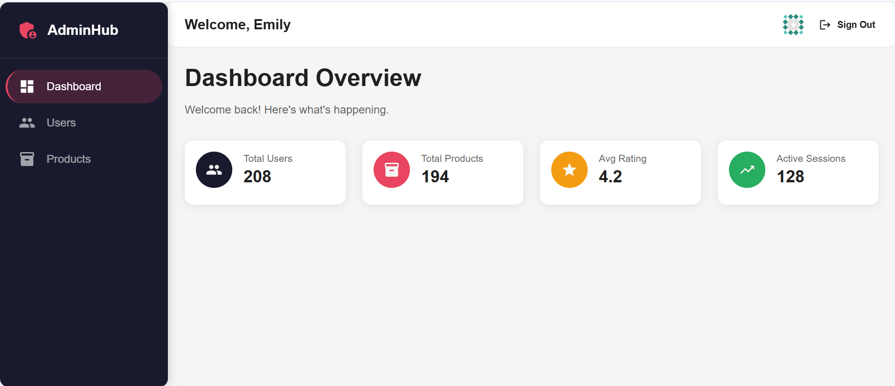
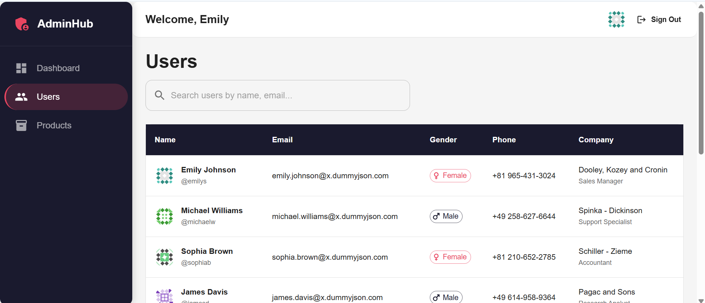
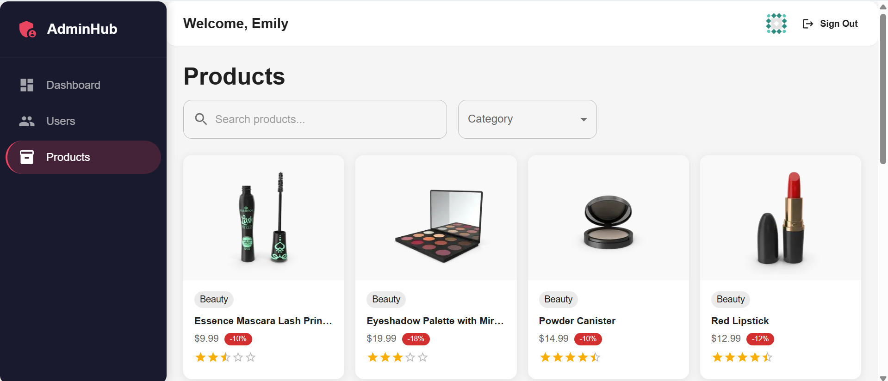

# Admin Dashboard

A modern, full-featured admin dashboard built with **Next.js 14**, **Material UI**, **Zustand**, and **NextAuth.js**, consuming the [DummyJSON](https://dummyjson.com/) public API.

---

## Tech Stack

| Layer | Technology |
|---|---|
| Framework | Next.js 14 (App Router) |
| UI | Material UI (MUI) v5 |
| State Management | Zustand v4 |
| Authentication | NextAuth.js v4 |
| Language | TypeScript |

---

## Features

### Authentication
- Login via DummyJSON `/auth/login` endpoint
- NextAuth.js credentials provider with JWT session strategy
- Auth token stored in NextAuth JWT (server-side secure)
- Zustand also synced for client-side access
- Protected dashboard routes redirect unauthenticated users to `/login`

### Users
- Paginated users list (10 per page, API-side pagination)
- Real-time search with 400ms debounce
- Responsive MUI table with skeleton loading states
- Full single-user detail view with organized sections

### Products
- Responsive MUI grid layout (1-4 columns based on screen size)
- API-side pagination (12 per page)
- Search with debounce
- Category filter dropdown
- Full single-product detail with image carousel, specs, and reviews

### Performance
- `React.memo` on `UserRow` and `ProductCard` to prevent unnecessary re-renders
- `useCallback` for event handlers
- Debounced search inputs
- **Zustand in-memory cache**: results are cached by `query:skip:limit` key — avoids redundant API calls when navigating back or revisiting pages
- Skeleton loading for all list views

---

## Why Zustand?

- **Zero boilerplate**: No actions, reducers, or dispatch — just a function
- **Built-in async**: Async calls live directly in the store, no middleware needed
- **Tiny footprint**: ~1KB gzipped vs Redux's much larger ecosystem
- **Perfect for small-medium apps**: The complexity of Redux is not justified here
- **Great DevX**: Works naturally with TypeScript and React hooks

---

## Setup

### Prerequisites
- Node.js 18+
- npm / yarn / pnpm

### Installation

```bash
git clone https://github.com/tanjim-alam/helpstudyabroadassignment
cd helpstudyabroadassignment
npm install
```

### Environment Variables

Copy `.env.local.example` to `.env.local`:

```bash
cp .env.local.example .env.local
```

Edit `.env.local`:

```env
NEXTAUTH_SECRET=your-secret-here   # generate: openssl rand -base64 32
NEXTAUTH_URL=http://localhost:3000
```

### Run

```bash
npm run dev
```

Open [http://localhost:3000](http://localhost:3000).

### Demo Credentials

| Username | Password |
|---|---|
| emilys | emilyspass |
| michaelw | michaelwpass |

(Any valid DummyJSON user works — see [dummyjson.com/users](https://dummyjson.com/users))

---

## Project Structure

```
src/
├── app/
│   ├── api/auth/[...nextauth]/   # NextAuth handler
│   ├── login/                    # Login page
│   └── dashboard/
│       ├── layout.tsx            # Protected layout with sidebar
│       ├── page.tsx              # Overview/stats
│       ├── users/
│       │   ├── page.tsx          # Users list
│       │   └── [id]/page.tsx     # User detail
│       └── products/
│           ├── page.tsx          # Products grid
│           └── [id]/page.tsx     # Product detail
├── components/
│   └── layout/
│       ├── Sidebar.tsx
│       └── Topbar.tsx
├── store/
│   ├── authStore.ts             # Auth state (Zustand + persist)
│   ├── usersStore.ts            # Users state + cache
│   └── productsStore.ts         # Products state + cache
├── types/
│   ├── index.ts                 # Domain types
│   └── next-auth.d.ts           # Session type extensions
└── lib/
    ├── ThemeRegistry.tsx         # MUI theme + emotion setup
    ├── EmotionCache.tsx          # SSR emotion cache
    └── SessionProvider.tsx       # NextAuth provider wrapper
```

---

## Caching Strategy

Both `usersStore` and `productsStore` implement a **read-through in-memory cache** using a `Map<string, Response>`:

- **Cache key**: `${query}:${skip}:${limit}` (or `cat:${category}:${skip}:${limit}`)
- **When hit**: Returns cached data immediately, no API call
- **When missed**: Fetches from API, stores in cache, updates state
- **Scope**: Session-scoped (cleared on page refresh)
- **Why useful**: Prevents redundant network calls during pagination and back navigation, significantly improving perceived performance

---

## Build

```bash
npm run build
npm start
```




